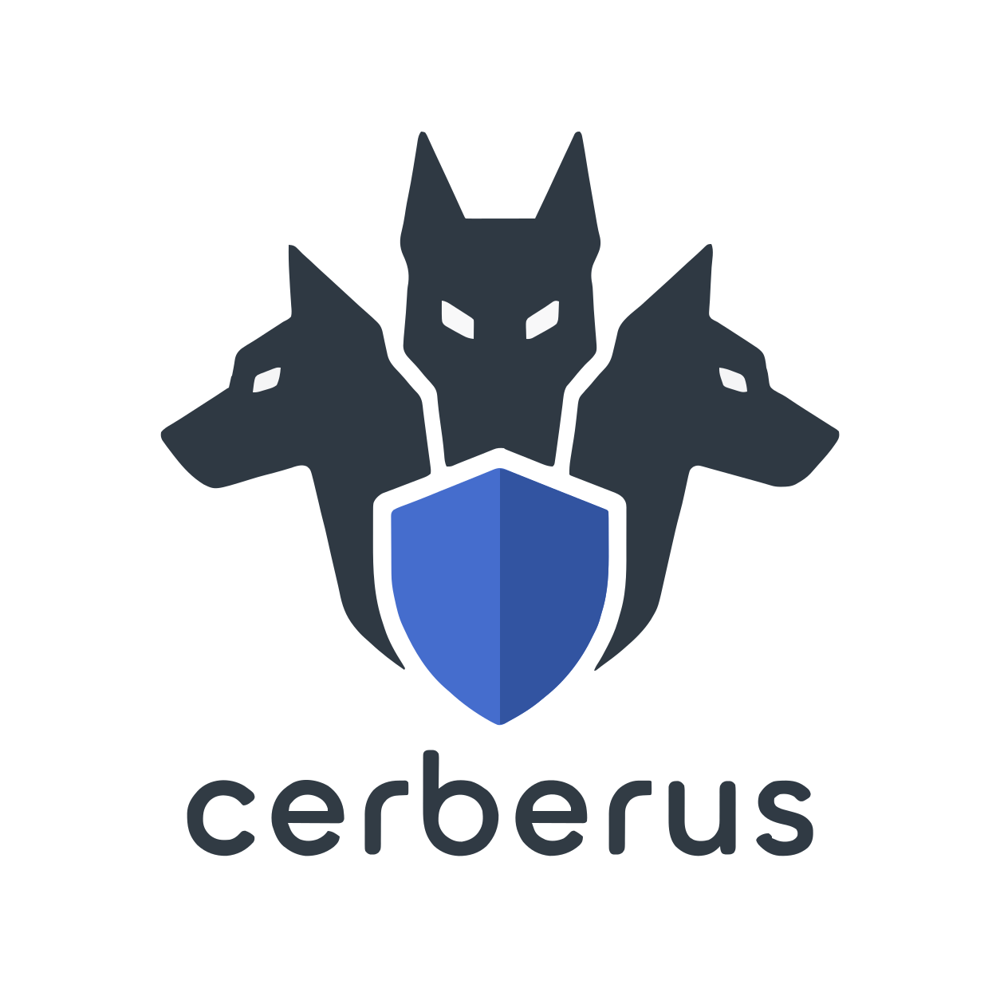

# cerberus



A guard for AI agent tool calls, with three heads.

cerberus is a Rust CLI that judges every state-changing tool call before
an agent executes it, regardless of which harness is asking. `cerberus
guard` runs a fail-closed `gate` and then up to three independent heads:

| Head | Catches | How |
| --- | --- | --- |
| `risk` | commands that are dangerous no matter who's running them or why *(general risk avoidance)* | command-pattern scanning via [tirith](https://github.com/sheeki03/tirith) |
| `policy` | calls that break a rule the org has decided on *(governance policy)* | policy evaluation via [cupcake](https://github.com/eqtylab/cupcake) |
| `judgement` | calls that are only bad because of state nothing in the payload reveals: git state, kubectl/terraform context, the hook payload itself *(contextual bad decisions)* | Rhai-scripted situational checks |

All three run by default and can be disabled individually.

```sh
git clone https://github.com/ahokinson/cerberus
cd cerberus
cargo install --path crates/cerberus
cerberus init      # writes rules, policies, config, and hook wiring
cerberus doctor    # confirms every head is actually enforcing
```

It works with Claude Code, Codex CLI, Cursor, Hermes Agent and opencode. Each
harness keeps its own hook mechanism; cerberus normalizes them at the edge.

If a head's binary goes missing, the guard fails closed and says why in the
next session. `cerberus doctor` diagnoses it and retests.

## Docs

- [Installing](docs/installing.md): requirements, what `cerberus init` does
- [Harnesses](docs/harnesses.md): supported agents and which tools are guarded
- [Usage](docs/usage.md): commands and the hook wiring
- [Configuration](docs/configuration.md): `config.toml`
- [Heads and rules](docs/heads.md): the shipped rules, policies and tirith overlay
- [Layered policy sources](docs/sources.md): team rule repos
- [Audit log](docs/audit.md): the optional local decision log
- [Diagnosing a degraded guard](docs/doctor.md): `cerberus doctor`
- [Design notes](docs/design.md): fail-open heads, fail-closed system
- [Development](docs/development.md): checks, coverage, fuzzing, CI

## Contributing

See [CONTRIBUTING.md](CONTRIBUTING.md) for the rule-script API and how to add
a rule or a policy, and [docs/development.md](docs/development.md) for build
and test tooling. Security issues: [SECURITY.md](SECURITY.md).

## License

MIT. See [LICENSE](LICENSE).
